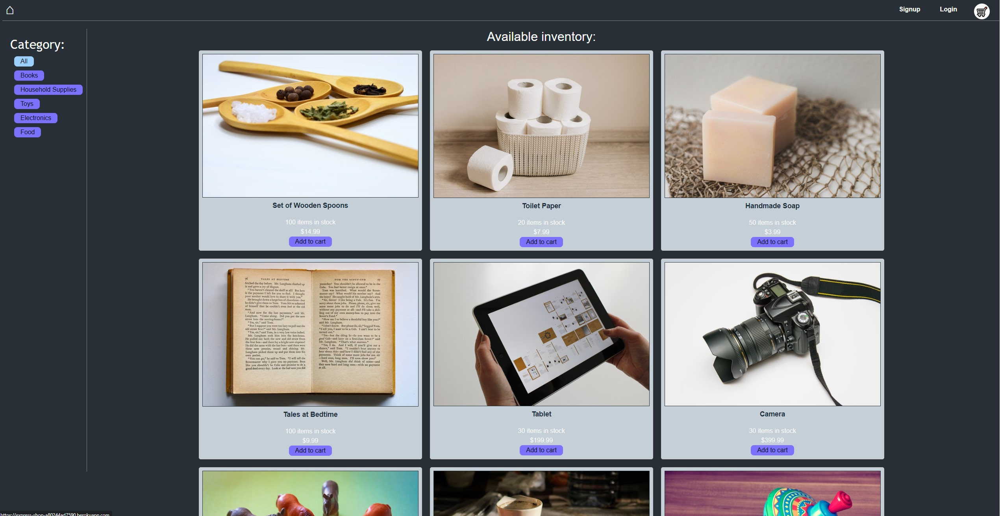

# Express-Shop

  
  

## Descripton
A ecommerce application that allows users to add/remove items to their cart. The cart will show each items price and the its quantity, with the total at the bottom with the checkout option. Once the user checks out they will be directed to a stripe checkout session once the information is completed the user will be redirected to the apps homepage with the users order in the order history. 
Link to deployed application can be found here https://express-shop-a80244ad7590.herokuapp.com//

## Table of Contents
  * [Installation Instructions](#installation-instructions)
  * [Application Usage](#application-usage)
  * [Contributors](#contributors)
  * [Licenses](#licenses)
  * [Tests](#tests)
  * [Contact Me](#contact-me)

## Installation Instructions
Before running this application you must install -Please run `npm i` in the files root, cleint, and server directories.

## Application Usage
The application allows users to shop within their own home.

## Contributors
By Chaz Graham

## Licenses
This application is licensed under: ISC

## Tests
To test application open the console and run the following comand: `npm run test`.

## Contact Me
If you have additional questions you can contact me at https://github.com/chazgraham or by Emailing me at chazhg80.cg@gmail.com